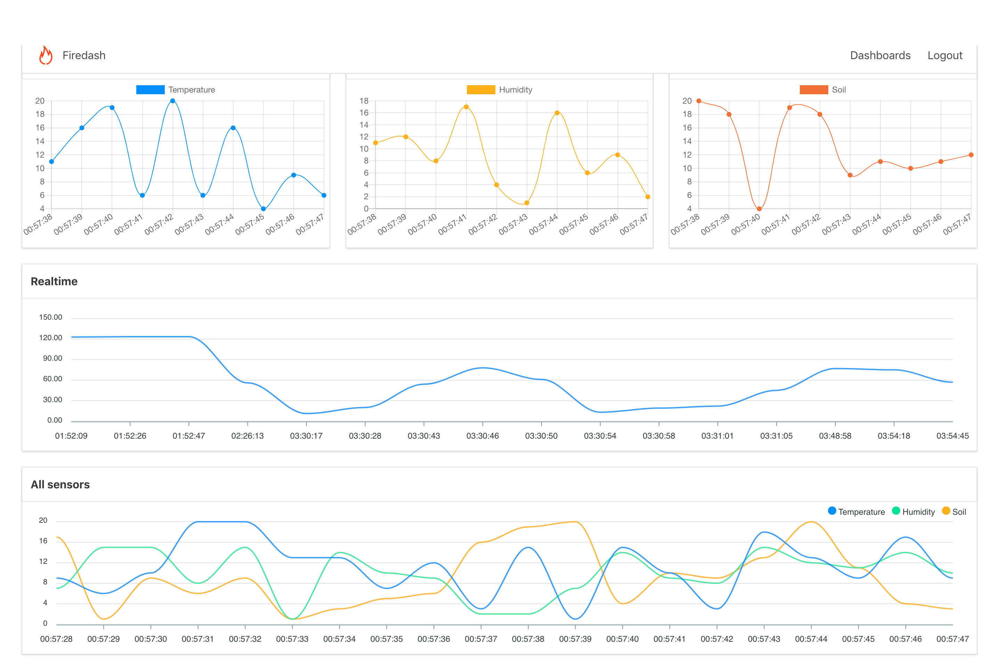

# Firedash

Dashboards for general purposes with batteries included.



## Features

Firedash come with batteries included.

- Account management;
- Devices management;
- API based;
- SQLite database;
- Input your device/sensor data using simple API;
- Output your device/sensor data using simple API;
- Create any dashboard using VueJS and their components (some chart libraries is included);

## API

Firedash work based on their own API:
- accounts
- devices
- profile
- tokens
- input data
- output data

Obs:
- Only user logged with account that is **administrator** can manager other accounts.
- Only user logged with any account can manage devices;

## How to use

To start use you will need install:

- python
- pip

Install all python dependencies:

> cd server  
> pip install -r requirements.txt  

Configure first time:  

> cp server/config/data.template.py server/config/data.py  
> cp db/app.template.db db/app.db  

Very important: Edit all **[CHANGE-HERE]** texts inside **server/config/data.py** using very secure keys. DON'T let this file with default keys, it is insecure.

In the configuration file you can change other things.  

Start server:

> cd server  
> FLASK_APP=app.py flask run  

Open in your browser:

http://127.0.0.1:5000

## Root account

We already create a root and administrator account with full privileges for you:

> E-mail: admin@admin.com  
> Password: admin  

Obs:  
**This account can be deleted (is protected by system), so change the e-mail and password of this root account after install and start. Create other accounts for your users.**

## Device data table

Firedash come with a simple SQLite database that let you store device data by type. Example: temperature, humidity, soil, etc of the device.  

### Input

Get the device token in web control panel of Firedash and execute on terminal the following command to input data into any device:

```
curl -X POST \
  http://localhost:5000/api/data/in \
  -H 'Authorization: Bearer: [DEVICE-TOKEN]' \
  -H 'Content-Type: application/json' \
  -d '{
    "type": "temperature",
    "value": 57
}'
```

You can make a request from your device using the IP and PORT of your server where Firedash is installed.

Obs:  
Replace **[DEVICE-TOKEN]** by your device token that you can get from control panel using your account.  


### Output

You can capture any amount of data from your Firedash device data table:  

```
curl -X POST \
  http://localhost:5000/api/data/out/device \
  -H 'Authorization: Bearer: [DEVICE-TOKEN]' \
  -H 'Content-Type: application/json' \
  -H 'content-length: 154' \
  -d '{
    "device_id": 1,
    "type": "temperature",
    "start_dt": "2019-06-29 01:52:00",
    "end_dt": "2019-06-29 03:00:00",
    "format_dt": "%H:%M:%S"
}'
```

Obs:  
Replace **[DEVICE-TOKEN]** by your device token that you can get from control panel using your account.  

## Web client

Firedash web client is inside folder **web-cli**.  

It is a VueJS web application, with sample dashboards, realtime dashboards from device data table.  

It has all administrator interfaces to manage everything from your web browser.  

You the following command to build a new web-cli and generate distribution files:  

> cd web-cli  
> npm run build

Or run the following command to open the web-cli in development mode:  

> cd web-cli  
> npm run dev  

All web-cli requests be proxied to server application (generally localhost:5000).

## Server

Server application contain all APIs, database and server configurations.  

All static data goes from web-cli **dist** folder.

Change server configuration in file **server/config/data.py**.  

## Docker

First, build the Firedash image:  

> docker build -t firedash .  

Second, start the container:  

> docker run -p 5000:5000 -v $(PWD):/app firedash

Third, open in your browser:

> http://localhost:5000

## Supported By Jetbrains IntelliJ IDEA


## License

[MIT](http://opensource.org/licenses/MIT)

Copyright (c) 2019-present, Paulo Coutinho
